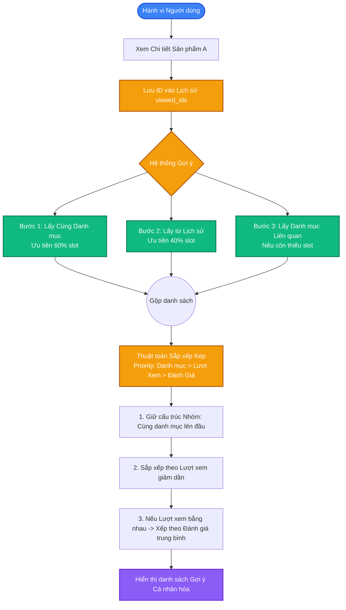

# Sơ đồ Logic Gợi ý & AI Tagging - OCOP Platform

Tài liệu này mô tả chi tiết cách dữ liệu sản phẩm được gắn thẻ (Tagging), cách AI phân loại hành vi người dùng, và thuật toán đằng sau hệ thống Gợi ý Cá nhân hóa (Recommendation Engine).

## 1. Hệ thống Gắn thẻ Dữ liệu (Data Tagging)

Mỗi sản phẩm trong cơ sở dữ liệu không tồn tại độc lập mà được "gắn thẻ" (tagging) với các ma trận dữ liệu sau:

- **Semantic Tags (Thẻ Ngữ nghĩa):** Tên sản phẩm, Nguồn gốc, Đặc điểm nổi bật, Thành phần.
- **Category Tags (Thẻ Danh mục OCOP):** 1 (Lương thực), 2 (Thực phẩm), 3 (Dược liệu), 4 (Thủ công mỹ nghệ), v.v.
- **Engagement Tags (Thẻ Tương tác):** `view_count` (Lượt xem thực tế), `avgRating` (Điểm đánh giá trung bình từ `product_reviews`).

## 2. Phân tích Dữ liệu Người dùng (User Intent)

Hệ thống theo dõi và phân tích người dùng qua 2 luồng chính:
1. **Lịch sử duyệt (Implicit Feedback):** Lưu trữ mảng `viewed_ids` trong LocalStorage. Mảng này liên tục cập nhật 5 sản phẩm xem gần nhất để phản ánh *Sự quan tâm tức thời (Short-term interest)*.
2. **Tìm kiếm bằng LLM (Explicit Intent):** Khi người dùng gõ tìm kiếm, mô hình LLM (Llama-3) phân tích ngữ nghĩa câu từ để tự động "map" (ánh xạ) sang `category_id` tương ứng mà không cần khớp từ khóa chính xác.

## 3. Thuật toán Gợi ý (Recommendation Logic Flow)

Quá trình quyết định hiển thị sản phẩm nào được thực hiện theo luồng ưu tiên nghiêm ngặt: **Danh mục (Context) -> Cá nhân hóa (History) -> Mức độ phổ biến (Views & Rating)**.

## 4. Ánh xạ Danh mục Liên kết (Cultural Mapping)

Khi không đủ sản phẩm cùng loại hoặc lịch sử trống, hệ thống sử dụng bản đồ liên kết văn hóa/tiêu dùng để lấp đầy:
- **Lương thực** liên kết chéo với **Thực phẩm, Đồ uống**
- **Thực phẩm** liên kết chéo với **Lương thực, Đồ uống**
- **Dược liệu** liên kết chéo với **Thực phẩm, Hàng tiêu dùng**
- **Hàng tiêu dùng** liên kết chéo với **Thủ công mỹ nghệ, Dược liệu**

## 5. Vai trò của AI trong tương lai (Machine Learning Integration)
Hiện tại, logic gợi ý đang chạy bằng rule-based (Dựa trên luật) kết hợp sorting thông minh. Để nâng cấp thành mô hình AI thực thụ (Collaborative Filtering hoặc Neural Collaborative Filtering) trong tương lai:
1. Sẽ cần thu thập thêm `user_id` và bảng `user_interactions (click, add_to_cart, purchase)`.
2. Dữ liệu Tagging (Đặc điểm, Nguồn gốc) sẽ được Vector hóa (Embeddings) để tính khoảng cách Cosine, cho phép gợi ý các sản phẩm "Có chung phong cách thiết kế/mùi vị" thay vì chỉ dựa vào Danh mục cứng.
